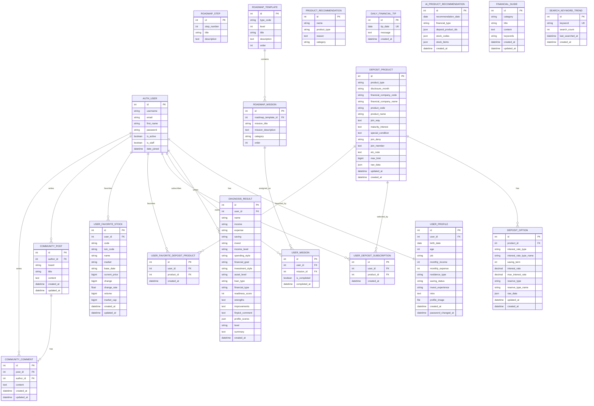

# FinPick ERD

이 문서는 `backend/finpick_app/models.py` 기준으로 정리한 FinPick 데이터 모델 ERD입니다.

## 전체 ERD

## 주요 관계 요약

| 관계 | 설명 |
| --- | --- |
| `AUTH_USER` 1:1 `USER_PROFILE` | 사용자 계정별 프로필 정보 |
| `AUTH_USER` 1:N `DIAGNOSIS_RESULT` | 사용자별 금융 진단 이력 |
| `ROADMAP_TEMPLATE` 1:N `ROADMAP_MISSION` | 금융 유형/단계별 미션 템플릿 |
| `AUTH_USER` N:M `ROADMAP_MISSION` | `USER_MISSION`을 통한 사용자별 미션 완료 상태 |
| `DEPOSIT_PRODUCT` 1:N `DEPOSIT_OPTION` | 예금/적금 상품별 금리 옵션 |
| `AUTH_USER` N:M `DEPOSIT_PRODUCT` | 가입 관심 모델과 즐겨찾기 모델로 분리 관리 |
| `AUTH_USER` 1:N `USER_FAVORITE_STOCK` | 사용자별 관심 주식 저장 |
| `AUTH_USER` 1:N `COMMUNITY_POST` | 사용자별 커뮤니티 게시글 |
| `COMMUNITY_POST` 1:N `COMMUNITY_COMMENT` | 게시글별 댓글 |
| `AUTH_USER` 1:N `COMMUNITY_COMMENT` | 사용자별 댓글 |

## 제약 조건

| 모델 | 제약 |
| --- | --- |
| `RoadmapTemplate` | `type_code`, `level` 조합 unique |
| `RoadmapMission` | `roadmap_template`, `mission_title` 조합 unique |
| `UserMission` | `user`, `mission` 조합 unique |
| `DailyFinancialTip` | `tip_date` unique |
| `AiProductRecommendation` | `recommendation_date`, `financial_type` 조합 unique |
| `FinancialGuide` | `category`, `title` 조합 unique |
| `SearchKeywordTrend` | `keyword` unique |
| `DepositProduct` | `product_type`, `financial_company_code`, `product_code` 조합 unique |
| `DepositOption` | `product`, `saving_term`, `interest_rate_type`, `reserve_type` 조합 unique |
| `UserDepositSubscription` | `user`, `product` 조합 unique |
| `UserFavoriteDepositProduct` | `user`, `product` 조합 unique |
| `UserFavoriteStock` | `user`, `code` 조합 unique |

## 독립 테이블

다음 모델은 현재 코드상 명시적인 ForeignKey 없이 독립적으로 사용됩니다.

- `RoadmapStep`
- `ProductRecommendation`
- `DailyFinancialTip`
- `AiProductRecommendation`
- `FinancialGuide`
- `SearchKeywordTrend`

